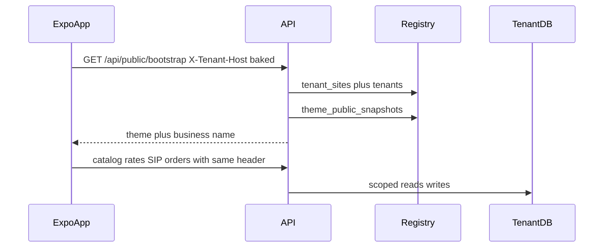

# Architecture

**Last updated:** 2026-08-21  
**Status:** Core tenancy implemented in this monorepo (`backend/`, `frontend/`). Progress: [PROGRESS.md](./PROGRESS.md).

## One-line summary

One shared **FastAPI** backend serves N jewelers. Each jeweler is a **tenant** with an isolated MongoDB database, one or more **customer site URLs** in the Registry, a **storefront theme**, and staff login using a **tenant code**. Customer UI today is an Expo **white-label** app per jeweler.

MealHQ is a different product. This platform does not share its Mongo cluster, Firebase project, or frontends.

---

## Shipped vs target

| Concern | Shipped (jweller-platform) | Target |
|---------|----------------------------|--------|
| Customer UI | Expo 54 + expo-router; bake `EXPO_PUBLIC_TENANT_*`; send `X-Tenant-Host` | Same public APIs; optional web storefront later |
| Jeweler admin | Interim Expo `/admin/*` | Dense Next.js at `admin.yourplatform.in` |
| Platform console | Seed script only | Next.js create-tenant wizard + provisioning worker |
| API | FastAPI + Motor monolith (`server.py`) | Modular routers; Beanie optional |
| Cache | None (Mongo every time); rates poller in-process | Redis `site:` / `theme:` |
| Files | External image URLs | R2 / MinIO `/{tenant_code}/...` |
| Shopper auth | `guest_id` | `+91` OTP + customer JWT |
| Payments | Reserve orders | Razorpay Model B |

Product locks (Host tenancy, DB-per-tenant, Model B, white-label native, India/INR) are unchanged.

---

## Why database-per-tenant

Jewelers will ask whether inventory, SIP liability, and KYC are mixed with other shops.

- True isolation: `mongo_client["tenant_RAJ001"]` vs `mongo_client["tenant_MEH002"]`.
- Offboard by detaching one database + R2 prefix.
- One noisy tenant can later move to its own cluster by changing `mongo_db_name` in Registry — application code stays the same.
- Mongo creates the database on first write; no `CREATE DATABASE` step.
- New fields are handled in Beanie defaults; there is no Postgres-style migration across 200 schemas. A **backfill worker** is still required when old documents must be rewritten.

Cross-tenant analytics (platform GMV) is a **federation job** over tenant databases, not a single query.

---

## Two-tier data

```
┌──────────────────────────────────────────────┐
│              REGISTRY DATABASE                │
│              (platform_registry)              │
│  tenants, tenant_sites, tenant_admins,        │
│  provisioning_jobs, platform_super_admins,    │
│  billing, theme_public_snapshots              │
└──────────────────────────────────────────────┘
          │  hostname or tenant_code → mongo_db_name
          ▼
   tenant_RAJ001    tenant_MEH002    tenant_…
   products         products
   customers        customers     ← same phone allowed here vs there
   site_theme       site_theme
   orders, SIP, …
```

**Registry** answers: which tenant is this Host? which DB? is the tenant active? who may log into admin?

**Tenant DB** holds everything the jeweler owns: catalog, customers, orders, SIP, CMS, theme, encrypted gateway keys.

There is **no** `db_connection_string` per tenant on a shared cluster. One Motor client, many database names. A per-tenant URI is reserved only if a huge tenant is later moved to another cluster.

---

## Apps

| App | Today | Target URL | How tenant is chosen |
|-----|-------|------------|----------------------|
| Customer storefront | Expo white-label APK / Expo Go | `{subdomain}.yourplatform.in` or custom domain (web optional) | **Host** / baked `X-Tenant-Host` → `tenant_sites` |
| Jeweler admin | Interim Expo `/admin` | `admin.yourplatform.in` (Next.js) | **Login:** tenant_code + username + password → JWT |
| Platform console | Not built | `console.yourplatform.in` | Super-admin only; Registry |
| API | FastAPI on backend URL | `api.yourplatform.in` | Same rules by route group (see [API.md](./API.md)) |

Customer site and jeweler admin must never share a cookie domain that would leak sessions across tenants.

**Expo → API (shipped):** client calls FastAPI with `X-Tenant-Host` set to the baked primary hostname. Never send client `tenant_id`.

**Browser → API (target web apps):** each Next.js app rewrites `/api/*` to FastAPI. Production may bind `api.yourplatform.in` for webhooks and workers.

**Sessions (target):** httpOnly cookies per app origin for web. Expo today uses in-memory / secure storage for admin JWT and guest id. Never set a cookie on `.yourplatform.in`.

---

## Stack

| Layer | Shipped | Target notes |
|-------|---------|--------------|
| API | FastAPI + Motor | One process; tenant DB per request |
| ODM | Raw Motor dicts | Beanie optional later |
| Mongo | One cluster, many DBs | Registry + `tenant_*` |
| Cache | — | Redis `site:{hostname}`, `theme:{tenant_id}`, rates |
| Queue | In-process rate refresh | Redis + worker for provision / SIP debit |
| Files | CDN URLs in seed | R2 prod; MinIO local |
| Customer UI | Expo + theme from bootstrap | Luxury retail language ([FRONTEND.md](./FRONTEND.md)) |
| Jeweler admin | Expo interim | Next.js dense ERP |
| Platform admin | — | Next.js console-only create |
| Locale / money | INR display | India v1: GST, IST, `+91` OTP |
| Payments | Reserve only | Tenant Razorpay (Model B) |

---

## Connection pattern

```
startup: one AsyncIOMotorClient(MONGO_URL)

per public request:
  host = normalize(X-Tenant-Host or Host)
  row = registry.tenant_sites.find(hostname)   # Redis cache is target, not shipped
  if missing or tenant.status != active → 404 / unavailable
  db = mongo_client[tenant.mongo_db_name]
  never read tenant_id from JSON body
```

Admin requests skip Host lookup and use JWT `tenant_id` / `tenant_code` → Registry → same `mongo_client[mongo_db_name]`.

---

## Request flows

### Customer app (Expo, shipped)



### Customer OTP (target — not shipped)

1. Host / baked host already selected tenant A.
2. `POST /api/public/auth/otp/request` with phone — OTP against **tenant A + phone**.
3. Verify → `find_or_create` in **tenant A** `customers`.
4. JWT: `{ sub, tenant_id: A, site_hostname, role: customer }`.
5. Same phone on tenant B is a **different** customer document.

### Jeweler admin

1. Open interim Expo admin **or** target `admin.yourplatform.in`.
2. Submit `tenant_code`, `username`, `password`.
3. Lookup Registry `tenant_admins` unique on `(tenant_code, username)`.
4. JWT `{ tenant_id, role, aud: admin }`.
5. Every admin query uses that tenant DB only.

---

## R2 layout

Single bucket, logical isolation by prefix:

```
/{tenant_code}/products/{product_id}/{file}
/{tenant_code}/site-assets/logo.png
/{tenant_code}/site-assets/favicon.ico
/{tenant_code}/site-assets/og.png
/{tenant_code}/kyc/{customer_id}/{file}     private, signed URLs
/{tenant_code}/invoices/{order_id}.pdf      private, signed URLs
```

Public product and logo objects may use a public CDN hostname. KYC and invoices never do.

Quota: `tenants.storage_used_bytes` vs plan cap, enforced on upload.

---

## Provisioning (async, idempotent)

**Today:** idempotent **seed** on API startup creates demo tenants (AURELIA, NOIR), sites, snapshots, admins, and tenant DB catalogs. No platform wizard.

**Target:** Signup or platform-admin “create tenant” **must not** block on DB setup.

1. Insert `tenants` with `status=provisioning`, `tenant_code`, `subdomain`, plan, wizard theme payload.
2. Insert `tenant_sites` for `{subdomain}.yourplatform.in`.
3. Enqueue `provisioning_jobs`.
4. Worker seeds tenant DB, theme snapshot, Redis, activates tenant.
5. Failures retry with backoff; tenant stays invisible until `active`.

See [OPERATIONS.md](./OPERATIONS.md) and [THEMING.md](./THEMING.md).

---

## Native app (Phase 7 — Expo shipped)

Customer apps are **white-label per tenant**: one build / Play Store listing per jeweler under that jeweler’s brand. No shared multi-store customer APK and no runtime store switch.

**Shipped:** Expo app bakes `EXPO_PUBLIC_TENANT_CODE`, `EXPO_PUBLIC_TENANT_HOST`, `EXPO_PUBLIC_TENANT_NAME`. Every public request sends `X-Tenant-Host` = baked host ([TENANT_SITES.md](./TENANT_SITES.md)).

**Still pending:** Play Store packaging pipeline (`applicationId`, icon, splash per tenant).

Same FastAPI and tenant DBs. No second tenancy model. Target jeweler admin is shared **web** Next.js; Expo `/admin` is interim only.
