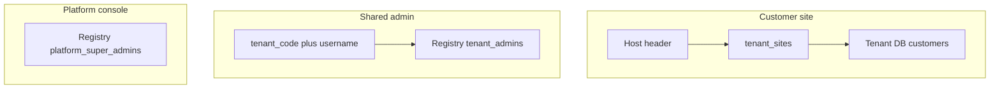

# Auth and identity

**Last updated:** 2026-08-17  
**Status:** Documentation. Not implemented.

Locked rule: **the same email or phone number must work on different customer sites**, as independent accounts. Tenancy is already known from the site URL before login runs.

---

## Three identity systems (do not mix)



| Actor | Store | Unique on | Login |
|-------|--------|-----------|--------|
| End customer | **That jeweler’s tenant DB** `customers` | `phone` and/or `email` **inside that DB** | Phone OTP (email OTP optional) **on that Host** |
| Jeweler staff | Registry `tenant_admins` (thin) + tenant DB `staff_profiles` | `(tenant_code, username)` | tenant_code + username + password |
| Platform operator | Registry `platform_super_admins` | email | Separate password / SSO; separate JWT `aud` |

---

## Why customers are per tenant DB

Database-per-tenant does **not** by itself force separate logins. We **choose** per-tenant customer rows because:

- Jeweler A owns KYC, credit, SIP, and purchase history. Jeweler B must not see them, even if the human is the same.
- Export/delete “my customers” is one database.
- OTP has no shared password to sync.

A **global** customer directory (one person, many jewelers, shared loyalty) is **out of v1**. Revisit only if the business wants platform-wide identity.

---

## Customer uniqueness (the email/phone rule)

Inside **one** tenant database:

- `customers.phone` unique (E.164), sparse if email-only is ever allowed.
- `customers.email` unique, lowercase, sparse if phone-only.

Across **two** tenant databases:

- `+9198…` on `rajjewellers.yourplatform.in` → customer `_id` in `tenant_RAJ001`
- same `+9198…` on `mehtajewels.com` → **different** `_id` in `tenant_MEH002`

There is no Registry collection of storefront customers in v1.

Staff usernames: the same email may be owner of RAJ001 and staff of MEH002 because uniqueness is `(tenant_code, username)`, not global email.

---

## Customer OTP flow (bound to Host)

1. Resolve tenant from Host ([TENANT_SITES.md](./TENANT_SITES.md)).
2. `POST /api/public/auth/otp/request` `{ phone }`  
   - Rate-limit by `(tenant_id, phone)` and by IP.  
   - Store OTP hash in Redis key `otp:{tenant_id}:{phone}` with TTL (e.g. 5 minutes).  
   - Do **not** create the customer yet (avoids junk rows).
3. `POST /api/public/auth/otp/verify` `{ phone, code }`  
   - Verify against that tenant’s OTP key only.  
   - `find_or_create` customer in **this** tenant DB.
4. Issue JWT (see claims below).
5. Optional profile completion: name, email, address. Email uniqueness checked in **this** DB only.

SMS provider is a platform integration. Message body may include jeweler display name from the resolved tenant.

---

## JWT rules

### Customer (`aud: customer`)

```
{
  "sub": "<customer_id>",
  "tenant_id": "<ObjectId>",
  "site_hostname": "rajjewellers.yourplatform.in",
  "role": "customer",
  "aud": "customer",
  "iss": "jewelers-platform"
}
```

On every customer API call:

1. Resolve Host → `tenant_id_from_site`.
2. Decode JWT.
3. If `aud != customer` → 401.
4. If `jwt.tenant_id != tenant_id_from_site` → 401 (token from another shop).
5. Prefer also matching `site_hostname` to current Host, **or** allow any **active** hostname of the same tenant (so `www` vs apex both work if both are registered). Document the chosen rule in implementation: **recommended: same tenant_id is enough; hostname in token is audit/debug.**

A token from Raj’s site is useless on Mehta’s site even if the phone number is identical.

**Native (Phase 7):** each shopper app bakes one primary hostname; OTP and JWT stay in that tenant DB only. Installing Mehta’s app does not reuse Raj’s token or account.

### Staff (`aud: admin`)

```
{
  "sub": "<tenant_admin_id>",
  "tenant_id": "<ObjectId>",
  "tenant_code": "RAJ001",
  "role": "owner" | "manager" | "sales_staff" | "accountant",
  "aud": "admin"
}
```

Host is ignored. Role checks are application-level; **database binding** is still `mongo_client[tenant.mongo_db_name]` from JWT `tenant_id` via Registry.

### Super-admin (`aud: platform`)

Cannot call `/api/admin/*` unless impersonation is started. Impersonation issues a **short-lived admin JWT** plus an audit row (`actor`, `tenant_id`, `reason`, `at`). Required for support; not optional.

---

## Passwords and sessions

- Staff: password hash (bcrypt over SHA-256) on Registry `tenant_admins`; optional `phone` (+91) for forgot-password SMS OTP; optional TOTP (`two_fa_enabled`, encrypted `totp_secret`).
- Customers: no password in v1 (OTP). **v1 OTP: Indian `+91` numbers only**, stored E.164.
- Admin forgot password: SMS OTP via same `LogSmsProvider` / `OTP_DEV_CODE` as customers (no email links in v1).
- Admin 2FA: opt-in authenticator TOTP from Profile (QuickerPay-style challenge on login).
- Cookies: httpOnly session cookie **per origin**. `admin.yourplatform.in`, `console.yourplatform.in`, and each customer hostname use different cookie names/domains. JWT is the payload inside the cookie, not a Bearer header from JS. No `.yourplatform.in` parent cookie (would leak across jeweler subdomains).

---

## Staff roles (jeweler admin)

| Role | Intent |
|------|--------|
| `owner` | Full, including gateway keys, domains, theme, billing |
| `manager` | Operations except secrets and plan changes |
| `sales_staff` | POS / orders / customers; no cost reports if policy says so |
| `accountant` | Reports, GST, purchases; no theme/domain |

Fine-grained ACL can live on `staff_profiles` in the tenant DB. Registry row: `tenant_code`, `username`, `password_hash`, `role`, `phone`, `two_fa_enabled`, encrypted TOTP secrets.

---

## Security checklist

- Never trust client `tenant_id` on public routes.
- Never look up customers in Registry or in “all tenant DBs”.
- OTP codes hashed at rest in Redis; not logged.
- Gateway keys encrypted at rest in tenant DB (or Registry if you prefer keys off tenant backups — **decision: tenant DB**, jeweler-owned secret, exported with their data).
- CORS: storefront origin must match an **active hostname** for that tenant, or admin origin for admin APIs.
